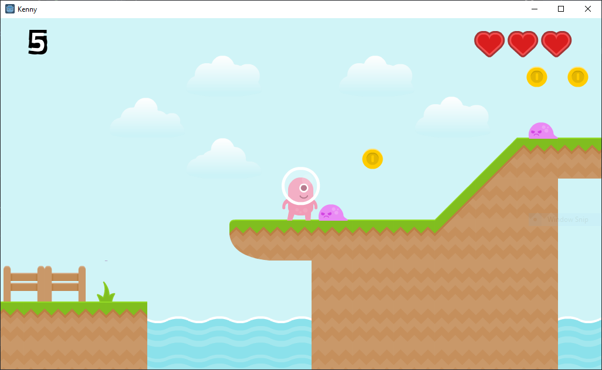

# Kenny

A simple demo platformer made using Godot Engine.

## Running

1) Download the latest version of [Godot Engine](https://godotengine.org).

2) Download this repository and navigate to the top level directory.

3) Run the `project.godot` file.

## Contributing

Feel free to add your own levels, adjust the code, add more enemies etc. to your liking.

## License

This is released under the GNU GPL v3 license.

## Credits

Thanks to [Kenny](http://kenny.nl) for the many amazing free assets that are available.
